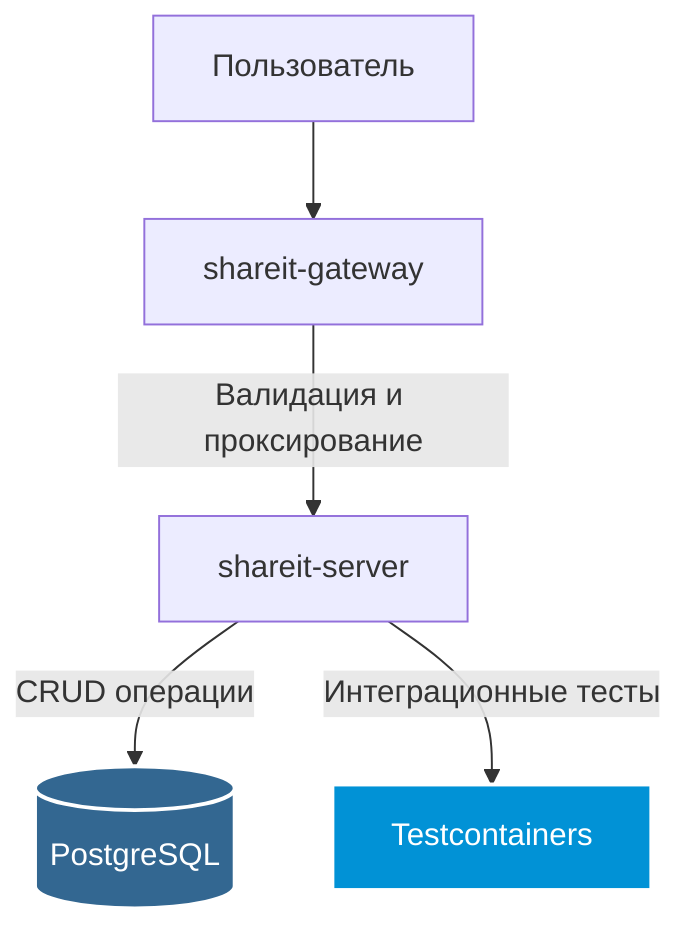

# Проект "ShareIt" - Сервис аренды вещей

Веб-сервис, который позволяет пользователям публиковать вещи для аренды (шеринга) и бронировать вещи других пользователей. Приложение представляет собой классическое монолитное веб-приложение с REST API.

---

### 🌟 Ключевые архитектурные решения и особенности

Несмотря на монолитную архитектуру, проект демонстрирует ряд важных инженерных практик:

*   **Профессиональный подход к тестированию:** Качество кода обеспечивается не только юнит-тестами (JUnit, Mockito), но и полноценными **интеграционными тестами с использованием Testcontainers**. Это гарантирует, что бизнес-логика корректно работает со слоем доступа к данным и реальной базой данных PostgreSQL.
*   **Четкое разделение ответственности (Gateway/Server):** Приложение архитектурно разделено на два модуля: `gateway`, отвечающий за прием и валидацию входящих запросов, и `server`, содержащий основную бизнес-логику. Это упрощает разработку и поддержку.
*   **Сложная доменная модель:** Проект реализует нетривиальные взаимосвязи между сущностями (Пользователи, Вещи, Бронирования, Комментарии) с помощью **Spring Data JPA**.
*   **Практика командной работы:** Проект был разработан в команде, где я выполнял **роль тимлида**.

---

### 🏗️ Архитектура приложения



---

### ⚙️ Технологический стек

*   **Язык:** Java 21
*   **Фреймворк:** Spring Boot
*   **ORM:** Spring Data JPA / Hibernate
*   **База данных:** PostgreSQL
*   **Тестирование:**
    *   **Unit:** JUnit 5, Mockito
    *   **Integration:** Testcontainers
*   **Сборка:** Maven
*   **Контейнеризация:** Docker, Docker Compose
*   **Качество кода:** Lombok, Checkstyle

---

### 🏆 Опыт командной работы (Роль Тимлида)

В рамках этого проекта я не только писал код, но выполнял обязанности тимлида. Это был отличный челлендж, который позволил мне посмотреть на разработку с новой стороны.

Мои основные задачи включали:

*   **Организация процесса разработки:** Настроил командный Git-flow с использованием `develop` ветки и `squash and merge` для пул-реквестов, чтобы поддерживать чистую историю в основной ветке.
*   **Планирование и декомпозиция задач:** Разбивал общее ТЗ на конкретные фичи, помогал распределять их между участниками команды с использованием доски в GitHub Projects.
*   **Проведение Code Review:** Активно участвовал в проверке всего кода, который добавлялся в проект. Следил за качеством, читаемостью и консистентностью кодовой базы, давал конструктивную обратную связь.
*   **Техническая поддержка и фасилитация:** Помогал коллегам разбираться с техническими трудностями (от проблем с Git до сложных SQL-запросов), организовывал созвоны для синхронизации и решения спорных моментов.

Этот опыт научил меня эффективно коммуницировать в команде, брать на себя ответственность не только за свой код, но и за общий результат, а также видеть проект в целом, координируя работу нескольких человек.

---

### 🚀 Как запустить локально

1.  Убедитесь, что у вас установлены `Docker` и `Docker Compose`.
2.  Склонируйте репозиторий: `git clone https://github.com/impatient0/java-shareit`
3.  Перейдите в корневую директорию проекта.
4.  Соберите проект:
    ```bash
    mvn clean install
    ```
5.  Выполните команду для запуска приложения и базы данных:
    ```bash
    docker compose up --build
    ```
6.  Приложение будет доступно по адресу `http://localhost:8080`.

---
### 📖 API

Документация к API была предоставлена в виде Swagger-спецификации и доступна в репозитории.